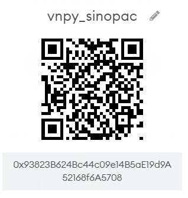

[](https://github.com/ypochien/vnpy_sinopac/blob/main/LICENSE)
[](https://github.com/ypochien/vnpy_sinopac/issues)


# Sinopac API - Shioaji 交易接口 for VeighNa框架

- Sinopac API - shioaji - https://sinotrade.github.io/
- VeighNa (VNPY) - https://github.com/vnpy/vnpy/
- vnpy_sinopac - https://github.com/ypochien/vnpy_sinopac

## Requirement
* VeighNa 3.0 
* Python 3.8 / 3.7 (建議用 Anaconda)
## Installation
```
pip install vnpy_sinopac
```
## Quickstarts
```
python scripy/run.py
```

## 關於下單方式
### 股票


### 期權


## 贊助 Donating
* 如果你發現這個專案有幫助到你，請考慮 [贊助](https://etherscan.io/address/ypochien.eth)
* ETH是最棒的，但其他TOKEN也都歡迎。
* 


